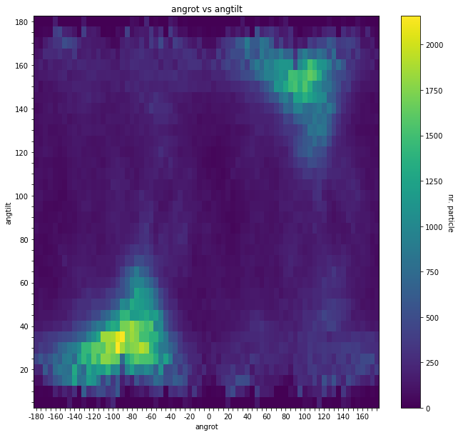
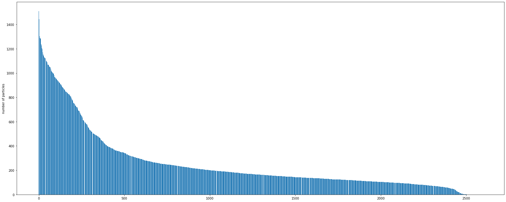
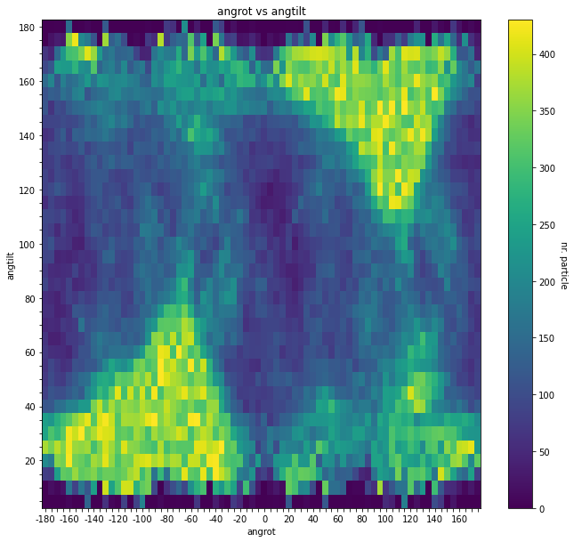
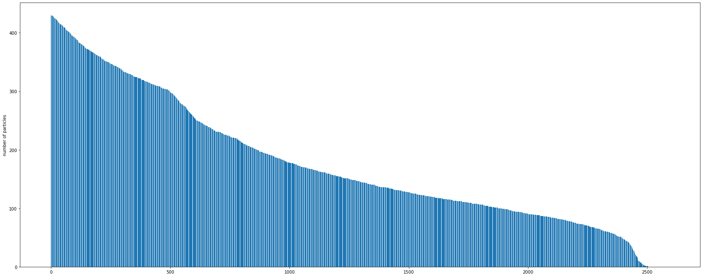

# CryoEm_Angular_Distribution
**a python script to remove particles for re-weighting angular distribution.**

keywords: Cryo-Em,relion,relin3.1,angular distribution,Euler angle

## usage:

  Please edit varibles below in main Function before executing script.
  
  * Change 'star_file' as original star file.(only relion3.1 run_data.star from Refine3D tested)
  * Change 'output_dir' for multiple star file generation. If output_dir does not exist, new dir will be created.
  * Jupyter lab will be helpful.

## use Function 'parse_and_preview' to plot angular Distribution
  **input:**
  
    star_file:path-like str
    
  **output:**
  
    final_data_list: 
    
        list[(int interval indices,
        pandas.Interval rot_interval,
        pandas.Interval tilt_interval,
        int number of particles in this group,
        list[int] particle indices in this group,)]
    
    output_dir: path-like str
                   
  'parse_and_preview' will generate several plots for angular Distribution.
    * relion_Rot vs number of particles
    * relion_Tilt vs number of particles
    * relion_Psi vs number of particles
    * heatmap of relion_Rot - relion_Tilt - number of particles
   plots will be saved as png in the same dir as 'star_file'
   
   a json file will also be generated to save list[(Rot,Tilt,Psi,particle-name:str)] parsed from run_data.star.
   
## use Function 'fix_euler_distribution' to plot angular Distribution
  **input:**
  
    star_file:path-like str. original run_data.star.
    output_dir:path-like str.
    final_data_list=final_data_list.
    rot_min:float range=-200.0.
    rot_max:float range=+200.0.
    tilt_min:float range=-1.0.
    tilt_max:float range=+ 200.0.
    remove_percent:float range=0.3.
    select_percent:float range=0.2.  # when auto_mode=False,this value will be ignored
    particle_number_threshold=-1.
    # bigger than this value is selected for next removal step
    auto_mode=False,
    # 'normal-mode' and 'auto-mode' is two strategies to remove particles for re-weighting angular distribution.
    
  **output:**
  
      
    new star file for Relion3.1
    plot: sorted 'Euler angle intervals vs number of particles' before removing paritcles.
    plot: sorted 'Euler angle intervals vs number of particles' after removing paritcles.
    brief report of total particles number and removed particle number.
    

### 'normal-mode' and 'auto-mode': two strategies to remove particles
  After 'parse_and_preview' you can check angular Distribution from the heatmap of relion_Rot - relion_Tilt - number of particles.
  Then, **'normal-mode'** will remove particles in range(rot_min,rot_max) and range(tilt_min,tilt_max) by a remove_percent.
  And particle_number_threshold will filter out sections with particle numbers bigger than that threshold for removing.
  
  For example, when Rot_min=10,Rot_max=60,Tilt_min=10,Tilt_max=60,remove_percent=0.3,particle_number_threshold=1700,
  script will delete 30% particles randomly for each section, of which particle number is larger than 1700 and section in range_rot(10,60),range_tilt(10,60).
  
  Another round of 'parse_and_preview' with new star file will be helpful to compare the angular distribution before and after removal.
  
  When using **'auto-mode'** should input True Flag in Function 'fix_euler_distribution'.
  Instead of inputing a Euler angle range to select sections, all sections (all intervals in heatmap) will be sorted by the number of particles.
  'select_percent' will select sections from the sections with most particles to the least until the selected particle number reach the ('select_percent' x total particle number). Then, for each selected section, random particles will be deleted by 'remove_percent'.
  
  
## jupyter lab will be helpful
  By using output star file as input, you are able to check angular Distribution conviniently from heatmap to tell whether to remove more or not.
  
### examples
#### before removal

#### after rounds of removal

